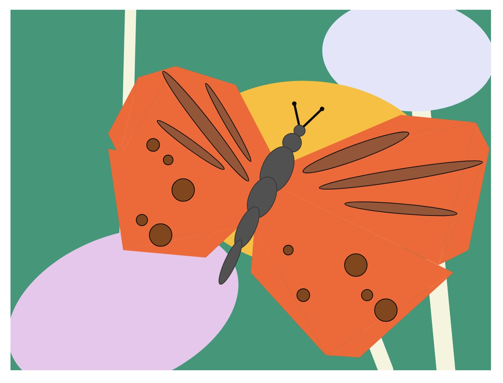
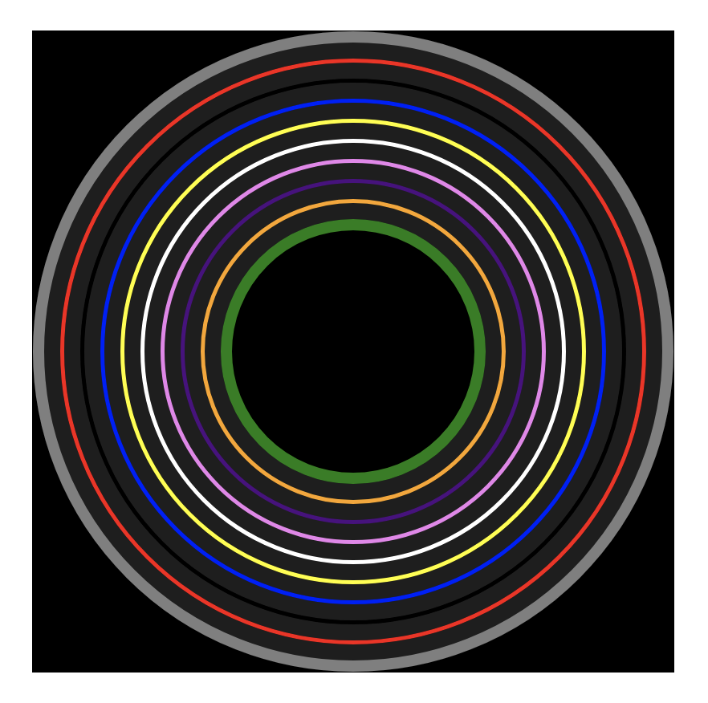

# cart 253 - website prototyping

This is Pippin Barr's coursework repository for CART253

This website is designed to collect and showcase my prototyping work in CART253.

## Reflective Journal 

[Reflective Journal](journal.md)

## Prototyping: Instructions

### Smell the Flowers 

https://sofia-aa34.github.io/cart253/prototypes/instructions/instructions-prototype-1/
https://github.com/Sofia-AA34/cart253/tree/main/prototypes/instructions/instructions-prototype-1

### Hypnosis 

https://sofia-aa34.github.io/cart253/prototypes/instructions/instructions-prototype-2/
https://github.com/Sofia-AA34/cart253/tree/main/prototypes/instructions/instructions-prototype-2

### Little Virus

https://sofia-aa34.github.io/cart253/prototypes/instructions/instructions-prototype-3/
https://github.com/Sofia-AA34/cart253/tree/main/prototypes/instructions/instructions-prototype-3

## Journal entry 

[Reflective Journal](journal.md)

