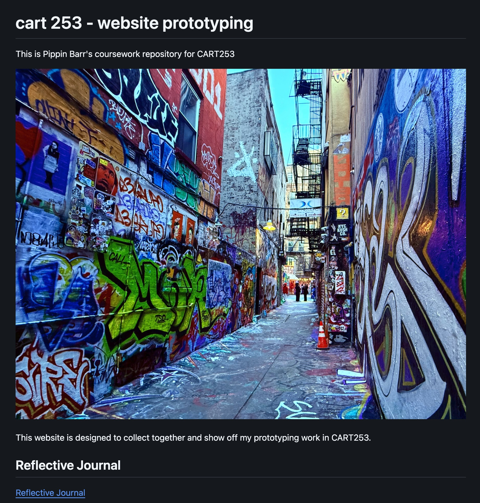

# Reflective Journal

## Thursday, September 17, 2026

Making a website with Markdown and GitHub has helped me thoroughly grasp the core concepts: what they are and how they interact, something I had REALLY struggled with when completing the first challenge. I finally understood how repositories fit within GitHub and how changes made in VS Code are translated into what you see in GitHub. I think it's cool how once you start to undertand what you are doing, instead of mindlessly following the instructions (because you have a hard time even comprehending the sentences), the whole process becomes fun. While it's frustrating that a small mistake or typo can prevent the whole website from working, it's very satisfying to see everything come together in the end. I was surprised that once I was halfway done, I could see that the assignment wasn't as complicated or tricky as it had first appeared to be when I skimmed through the instructions. Programming had always seemed like an alien language to me and I struggled to understand how it can even be taught to someone, but now I realize that you simply have to "play around" and observe how everything works. I hope that for the following assignments, I can use what we learn through the lessons to edit the layout and design of my pages so they become recognizable as my work. I want my audience to be intrigued by my projects and eager to see what I will offer next.

## Thursday, Septemeber 24, 2026

This assignment took me way longer than I expected, easily around three hours per prototype. The instructions were clear, I had ideas for what I wanted to create from day one, and it wasn't extremely hard overall, but because I truly don't have any prior experience in programming, I feel like I make every mistake possible every time I write something. The trickiest part was taking certain set functions and figuring out how to adapt them to my own ideas. You think you understand what a variable does and where a function should go, and then everything just disappears off your screen. 

Some functions looked pretty logical, but others felt like straight gibberish no matter how many parts of them I looked up. Even when I searched things up, it felt like the answers I needed simply didn't exist or they were buried inside someone else's code that made no sense to me. The worst part was trying to debug when nothing looks wrong but the page is still blank. I genuinely wanted to give up. 

I do understand better now where everything is in my repository and what belongs inside my project files. It's getting easier to remember to commit after finishing a specific action, and I feel more comfortable knowing what to write in my descriptions. It's also satisfying to see the final prototypes come to life, even if they didn't turn out exactly (or anything) like I first imagined. I liked creating the interactive elements the most because they looked cool.